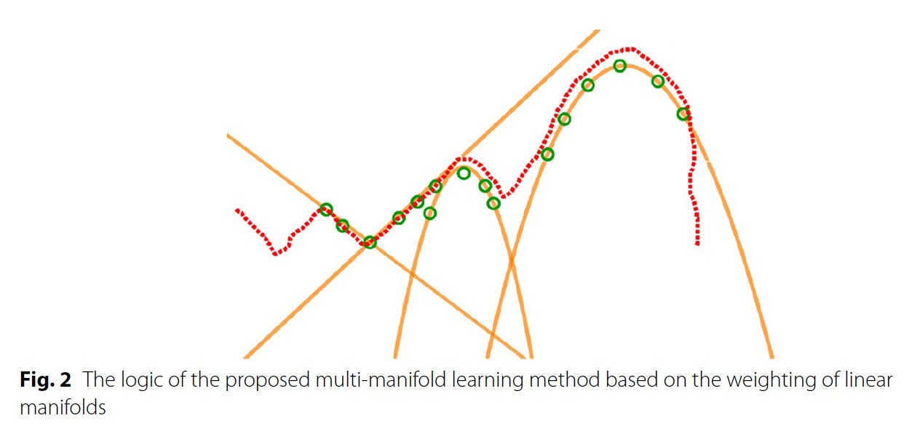
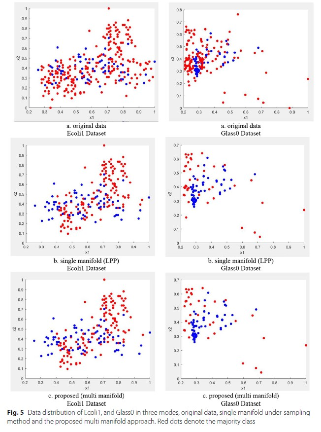

# Multi-Manifold-Learning-based-Under-Sampling

imbalanced learning is one of the main challenges of classification in real world problems. 
This challenge occurs when the number of examples of the majority class is more than the number of examples of the minority class.
Fraud detection, image segmentation, network intrusion detection, disease detection, etc. are all imbalanced problems.
Therefore, the approach of this research can be used in real world problems.

If you are interested in imbalanced learning, 
you can improve the proposed approach and use its results in your research or in real-world problems.

Under-sampling is a technique to overcome imbalanced class problem, however, 
selecting the instances to be dropped and measuring their informativeness is an important concern. 
This paper tries to bring up a new point of view in this regard and exploit the structure of data to decide on the importance of the data points.
For this purpose, a multi-manifold learning approach is proposed. 
Manifolds represent the underlying structures of data and can help extract the latent space for data distribution.
However, there is no evidence that we can rely on a single manifold to extract the local neighborhood of the dataset.
Therefore, this paper proposes an ensemble of manifold learning approaches and evaluates each manifold based on an information loss-based heuristic. 
Having computed the optimality score of each manifold, the centrality and marginality degrees of samples are computed on the manifolds and weighted by the corresponding score.
A gradual elimination approach is proposed, which tries to balance the classes while avoiding a drop in the F-measure on the validation dataset.

## Figures

  
   
 

  
   
 

To run the simulation of this research, you must first install the Matlab toolbox for dimensionality reduction 
via https://lvdmaaten.github.io/drtoolbox/.
In this research, the dimension reduction toolbox was used only for unsupervised linear mapping of imbalanced data,
and the dimension reduction operation was not performed on the data.
Then run the under_sampling_program.m file. 
For each specific dataset, you should run the command to load it and after under-sampling,
see the performance criteria by classification.

## Citation
If you find Multi-Manifold-Learning-based-Under-Sampling useful in your research, please consider citing our paper:

A Multi-Manifold Learning Based Instance Weighting and Under-Sampling for Imbalanced Data Classification Problems,
T Feizi, MH Moattar, H Tabatabaee, Journal of Big Data, 2023. 10 (1), 153

[Link to the paper](https://journalofbigdata.springeropen.com/articles/10.1186/s40537-023-00832-2#auth-Mohammad_Hossein-Moattar-Aff1)
