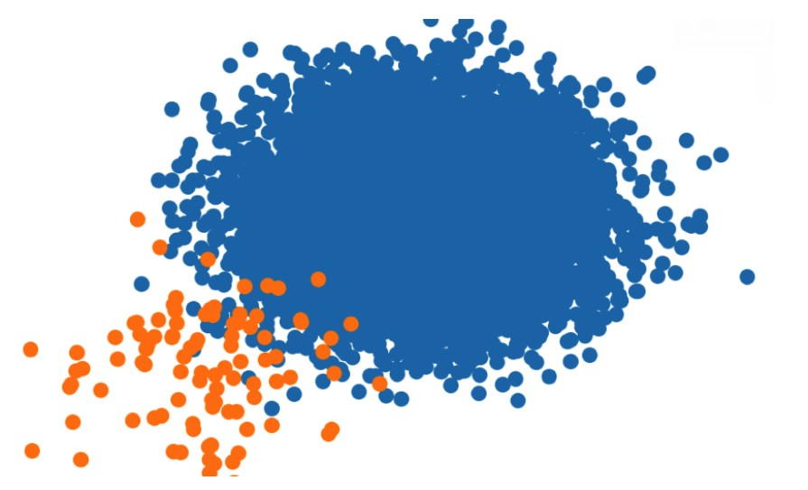

<a href="https://journalofbigdata.springeropen.com/articles/10.1186/s40537-023-00832-2#auth-Mohammad_Hossein-Moattar-Aff1" data-popup="right" data-size="large" class="plumx-plum-print-popup" data-site="plum" data-hide-when-empty="true">A Multi-Manifold Learning Based Instance Weighting and Under-Sampling for Imbalanced Data Classification Problems</a>

# Multi-Manifold-Learning-based-Under-Sampling

    

## Applications
- imbalanced learning is one of the most difficult categorization challenges in real-world applications. This problem comes when the majority class has more instances than the minority class. Fraud detection, image segmentation, network intrusion detection, disease diagnosis, and other similar challenges are all imbalanced. As a result, the approach developed in this study can be applied to real-world challenges.
- If you are interested in imbalanced learning, you can refine the proposed approach and apply the results to your study or real-world issues.

## Overview
Under-sampling is a technique to overcome imbalanced class problem, however, selecting the instances to be dropped and measuring their informativeness is an important concern. This project tries to bring up a new point of view in this regard and exploit the structure of data to decide on the importance of the data points.For this purpose, a multi-manifold learning approach is proposed. Manifolds represent the underlying structures of data and can help extract the latent space for data distribution. However, there is no evidence that we can rely on a single manifold to extract the local neighborhood of the dataset. Therefore, this project proposes an ensemble of manifold learning approaches and evaluates each manifold based on an information loss-based heuristic. Having computed the optimality score of each manifold, the centrality and marginality degrees of samples are computed on the manifolds and weighted by the corresponding score. A gradual elimination approach is proposed, which tries to balance the classes while avoiding a drop in the F-measure on the validation dataset.

## Figures

  
   
 

  
   
 

## Dataset
The dataset used in this project is located in the data folder. These data are standard and used in other research.
 
## Installation and Setup
- First, install MATLAB 2018 or higher version, then install the dimension reduction toolbox.
- To run the simulation of this research, you must install the Matlab toolbox for dimensionality reduction 
via https://lvdmaaten.github.io/drtoolbox/.
- In this research, the dimension reduction toolbox was used only for unsupervised linear mapping of imbalanced data,
and the dimension reduction operation was not performed on the data.

## How to run the code
- Run the under_sampling_program.m file.
- The descriptions of the codes are placed separately in each file.
- For each specific dataset, you should run the command to load it and after under-sampling,
see the performance criteria by classification.

## Result
- **High performance:** The evaluation results of the approaches based on the average F-Measure show that the proposed multi-manifold approach has a better average  performance compared to other methods.
- **High scalability:** The efficiency of the proposed multi-manifold method is maintained for data with small and large number of samples, small and large number of features, low and large imbalance coefficient.
- **High robustness:** The efficiency of the proposed multi-manifold method is maintained with a very high imbalance coefficient.

## Citation
If you use this code in your research or projects, please cite the following paper:

A Multi-Manifold Learning Based Instance Weighting and Under-Sampling for Imbalanced Data Classification Problems,
T Feizi, MH Moattar, H Tabatabaee, Journal of Big Data, 2023. 10 (1), 153

[Link to the paper](https://journalofbigdata.springeropen.com/articles/10.1186/s40537-023-00832-2#auth-Mohammad_Hossein-Moattar-Aff1)
